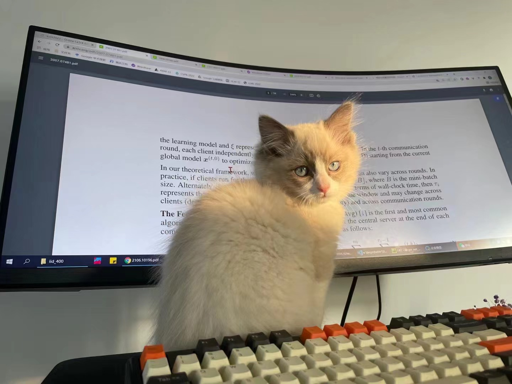
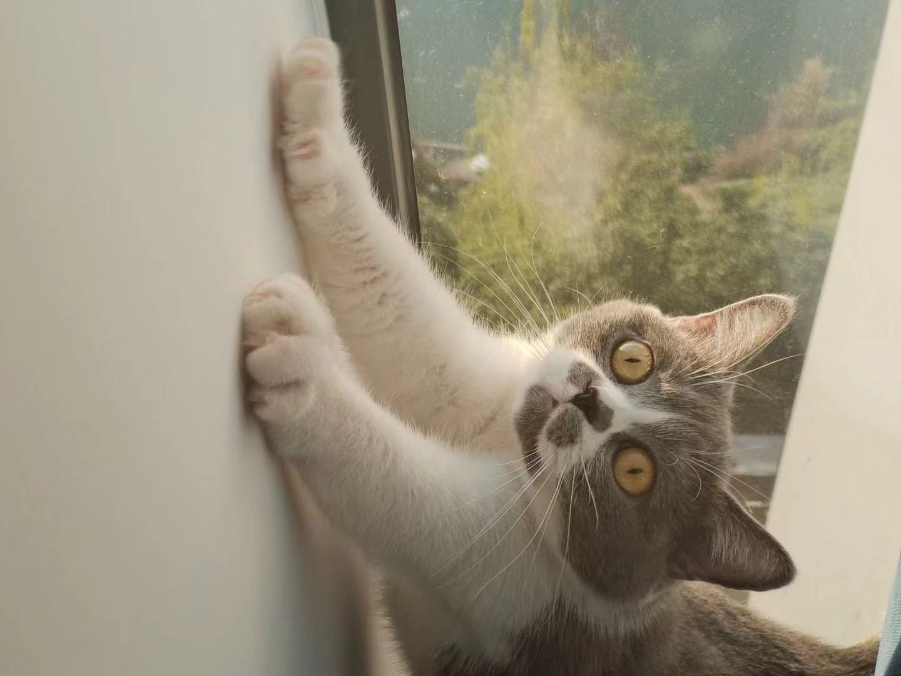

# 📖 Educations
- &#x1F393;  *2024.08 - Present*, PhD in Computer Vision, Mohamed Bin Zayed University of Artificial Intelligence, Abu Dhabi, UAE.
- &#x1F393;  *2022.08 - 2024*, Masters in Machine Learning, Mohamed Bin Zayed University of Artificial Intelligence, Abu Dhabi, UAE.
- &#x1F393;  *2019.08 - 2022.06*, Bachelors in Computer Science, Aligarh Muslim University, Aligarh, India.

# 💬 Services

- Journal Reviewer:  
    - Nature Scientific Reports  
    - IEEE Transactions on Circuits and Systems for Video Technology  
    - ACM Transactions on Intelligent Systems and Technology  
    - Springer Journal of Supercomputing  
    - IEEE Access  
    - Cryptologia  
    - IEEE Transctions of Artificial Intelligence

- Conference Reviewer:  
    - Conference on Computer Vision and Pattern Recognition (CVPR)
    - International Conference on Computer Vision (ICCV)  
    - Winter Conference on Applications of Computer Vision (WACV)  
    - Medical Image Understanding and Analysis (MIUA)  
    - Sustainability and Resilience Conference (SRC)  

# 💻 Experiences
- *2025.09 - 2025.12*, [Microsoft Research India, Bangalore](https://www.microsoft.com/en-us/research/lab/microsoft-research-india/), Visiting Researcher, India.
- *2024.08 - Present*, [BioMedia Lab](https://mbzuai-biomedia.com/biomedia/), Graduate Researcher, UAE.
- *2022.09 - 2024.07*, [Sprint-AI Lab](https://www.sprintai.org/), Graduate Researcher, UAE.
- *2023.06 - 2023.09*, [Fujairah Research Center](https://www.frc.ae/), Visiting Researcher, UAE.
- *2021.03 - 2022.07*, [Aligarh Muslim University](https://www.amu.ac.in/department/computer-science), Research Assistant, India.
- *2021.09 - 2021.12*, [National University of Malaysia, UKM](https://www.ukm.my/portalukm/), Research Intern, Malaysia.
- *2021.06 - 2021.08*, [Computer Science Society, AMU](https://www.cssamu.in/), Research Intern, India.
- *2021.05 - 2021.08*, [Indian Institute of Information Technology, Allahabad](https://www.iiita.ac.in/), Research Intern, India.

# 🎙 Miscellaneous

### Travel
Raza enjoys traveling with his family and friends. He is always excited about visiting new places and learning about different cultures.

### Sports
Raza loves playing sports and always makes time for football, badminton, and table tennis. He has played taekwondo professionally before and represented his university in badminton and table tennis competitions.

<!-- ### My cat
Raza and his girlfriend have three cats together; they are very adorable and have brought a lot of fun to their lives! -->

<!--   
 
  -->

<!-- 
Football Team

MBZUAI Sports Week

Georgia Trip
 -->

    

        
Football Team

        
    

    
    

        
MBZUAI Sports Week

        
    

    
    

        
Georgia Trip

        
    

    

 

    

        
Bouldering Clymb

        
    

    

        
Scotland Trip

        
    

    

        
Uzbekistan Trip

        
    

### Favorite Quote
``When you give flowers to a loved one on a special occasion, are they made of plastic so that they live forever? No, they're made of flower petals. But there's a pistil, there's a stamen, there's a stalk, and that will all die. And it's the fact that it dies that empowers our emotions to appreciate it that much more. So the finiteness of life forces me to appreciate every sunrise that I wake up every day. And if I live forever, I don't know that I would have those emotions or those feelings or that sense that the day awaits my energy. And so, a much scarier prospect than dying for me is the prospect of living forever`` ~~ Neil deGrasse Tyson

